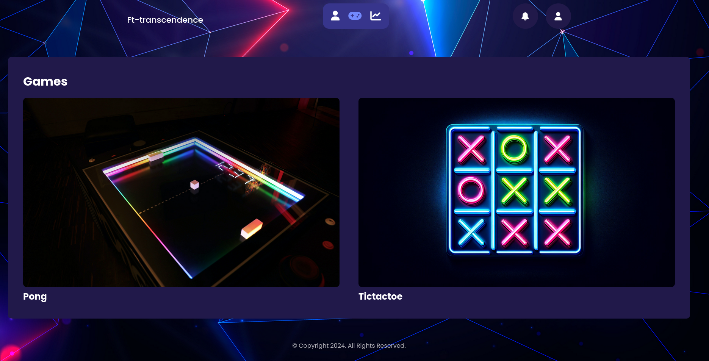
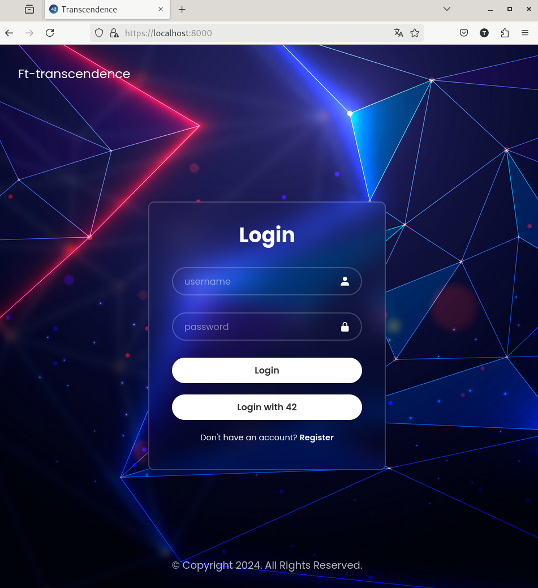
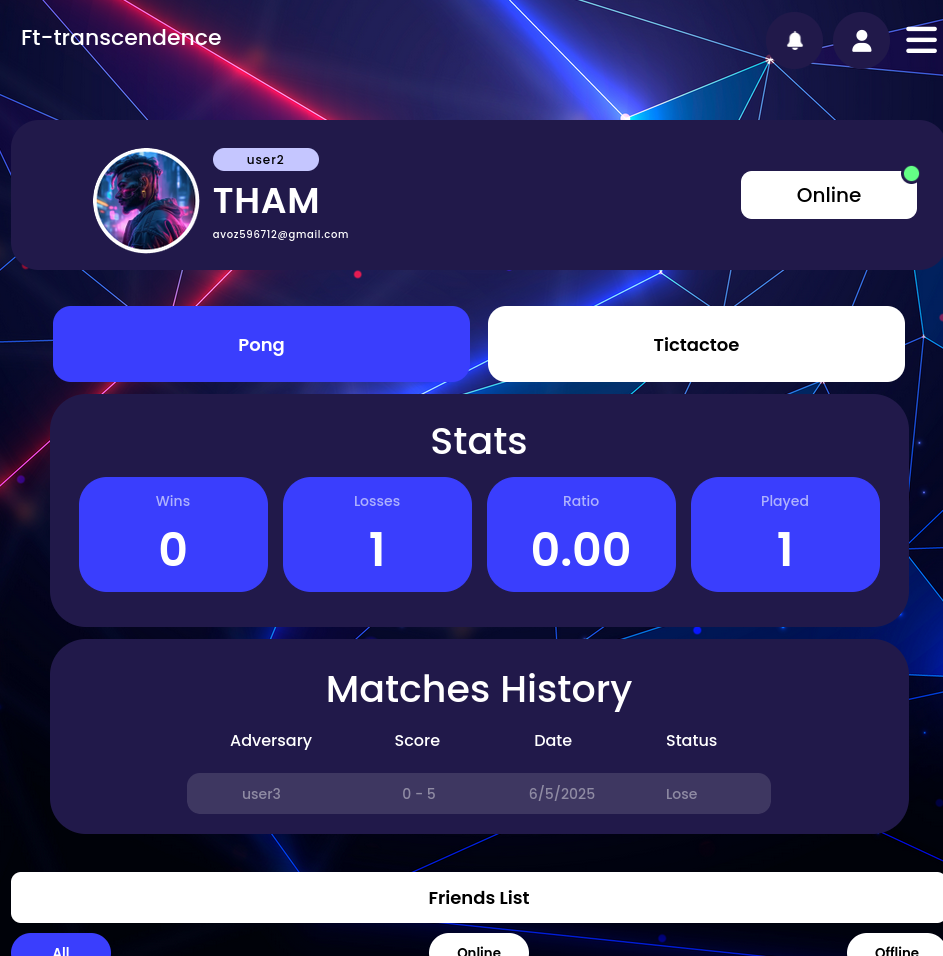

# 🎮 ft_transcendence

A full-stack web application featuring real-time multiplayer games with 3D graphics, tournaments, and social features.

**Quick Start:** `docker compose up --build` → [https://localhost:8000](https://localhost:8000)



## Gameplay Preview

### 3D Pong
<https://github.com/user-attachments/assets/gameplay-pong-3d.webm>

### 3D Tic-Tac-Toe
<https://github.com/user-attachments/assets/gameplay-tictactoe-3d.webm>

## Features

- **Real-time multiplayer games** (Pong & Tic-Tac-Toe) with 3D graphics
- **Tournament system** with bracket management
- **Social features** including friends, profiles, and leaderboards
- **OAuth authentication** with 42 School API
- **WebSocket-powered** real-time updates



## Tech Stack

- **Backend:** Django, PostgreSQL, WebSockets
- **Frontend:** JavaScript, Three.js, CSS3
- **DevOps:** Docker, Nginx
- **Authentication:** OAuth 2.0 (42 School API)



## Quick Start

```bash
# Clone and setup
git clone https://github.com/tham-le/ft_transcendence.git
cd ft_transcendence

# Create .env file (see .env.example)
# Then launch with Docker
docker compose up --build

# Access at https://localhost:8000
```

## Environment Setup

Create a `.env` file in the root directory:

```bash
DJANGO_SUPERUSER_USERNAME=admin
DJANGO_SUPERUSER_PASSWORD=your_password
DJANGO_SUPERUSER_EMAIL=admin@example.com
DOMAIN=localhost
IP=127.0.0.1
POSTGRES_DB=transcendence_db
POSTGRES_USER=transcendence_user
POSTGRES_PASSWORD=your_db_password
CLIENT_ID=your_42_client_id
CLIENT_SECRET=your_42_client_secret
```

## Key Features

- **Real-time multiplayer gaming** with WebSocket architecture
- **3D game rendering** using Three.js
- **Tournament system** with automatic bracket generation
- **Social features**: Friends system, user profiles, leaderboards
- **OAuth integration** with 42 School API
- **Production-ready** Docker deployment with SSL

## Development

### Makefile Commands

- `make up` - Start the application
- `make down` - Stop containers
- `make build` - Build Docker images
- `make logs` - View container logs
- `make clean` - Remove cache files
- `make reset` - Full rebuild and restart

## Contributing

1. Fork the repository
2. Create a feature branch: `git checkout -b feature/your-feature`
3. Commit your changes: `git commit -m "Add feature"`
4. Push to the branch: `git push origin feature/your-feature`
5. Create a Pull Request

## License

This project has no specific license.
